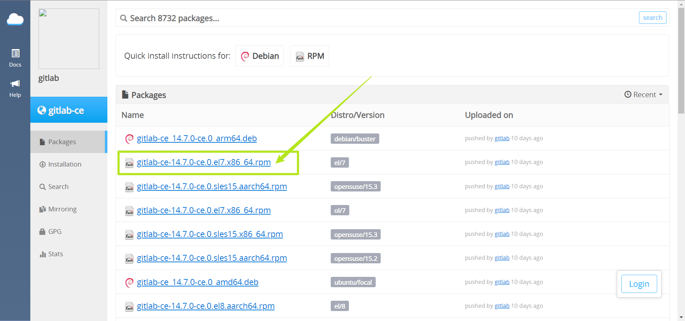

在CentOS 7上安装GitLab 14.7

在 CentOS 7（以及 RedHat/Oracle/Scientific Linux 7）上，下面的命令还将在系统防火墙中打开 HTTP、HTTPS 和 SSH 访问

```bash
sudo yum install -y curl policycoreutils-python openssh-server perl

#查看openssh服务状态
sudo systemctl status sshd

#设置openssh服务开机启动
sudo systemctl enable sshd

#启动openssh
sudo systemctl start sshd

#查看防火墙是否打开
sudo systemctl status firewalld

#防火墙添加http和https
sudo firewall-cmd --permanent --add-service=http
sudo firewall-cmd --permanent --add-service=https

#重新加载防火墙
sudo systemctl reload firewalld
```

在线安装：

1. 添加 GitLab 包存储库

```bash
curl -s https://packages.gitlab.com/install/repositories/gitlab/gitlab-ce/script.rpm.sh | sudo bash
```

2. 安装

```bash
yum install -y gitlab-ce
```

离线安装

1. 下载Gitlab软件包上传到CentOS

访问 https://packages.gitlab.com/gitlab/gitlab-ce/ 获取对应的软件包




2. 安装GitLab

```bash
yum -y install gitlab-ce-14.7.0-ce.0.el7.x86_64.rpm
```

配置访问地址和端口

vim /etc/gitlab/gitlab.rb

```bash
external_url 'http://192.168.1.22:8000'

nginx['listen_port'] = 8000
```

重载配置、重启服务

```bash
gitlab-ctl reconfigure

gitlab-ctl restart
```

把端口添加到防火墙

```bash
firewall-cmd --zone=public --add-port=8000/tcp --permanent

#重新加载防火墙
firewall-cmd --reload
```

默认有一个用户root，安装时没有设置密码，密码随机生成，在目录 `/etc/gitlab/initial_root_password`
