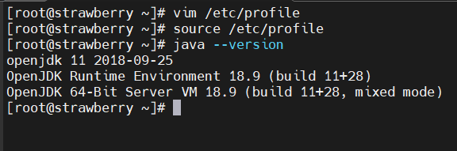

下载 jdk，下载速度很慢，可以使用迅雷下载之后上传到CentOS

```bash
wget https://download.java.net/openjdk/jdk11/ri/openjdk-11+28_linux-x64_bin.tar.gz
```

解压到`/opt/`目录下

```bash
tar xvf openjdk-11+28_linux-x64_bin.tar.gz -C /opt/
```

配置jdk环境变量，`vim /etc/profile`添加如下配置

```bash
export JAVA_HOME=/opt/jdk-11
export PATH=$PATH:$JAVA_HOME/bin
```

使配置生效

```bash
source /etc/profile
```

验证配置是否正确 `java --version`，输出一下内容证明配置正确


        
