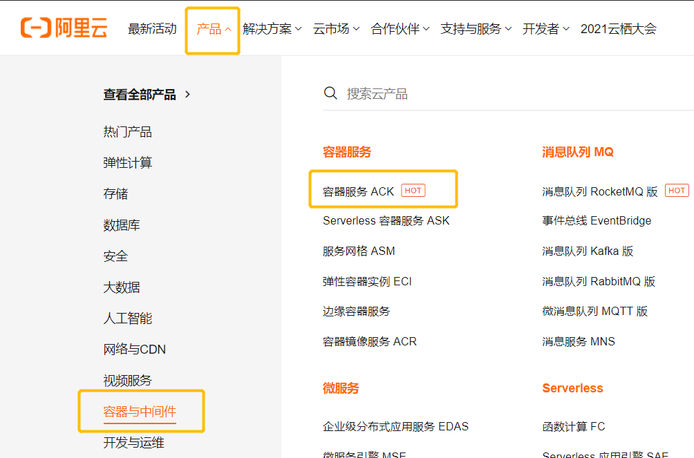
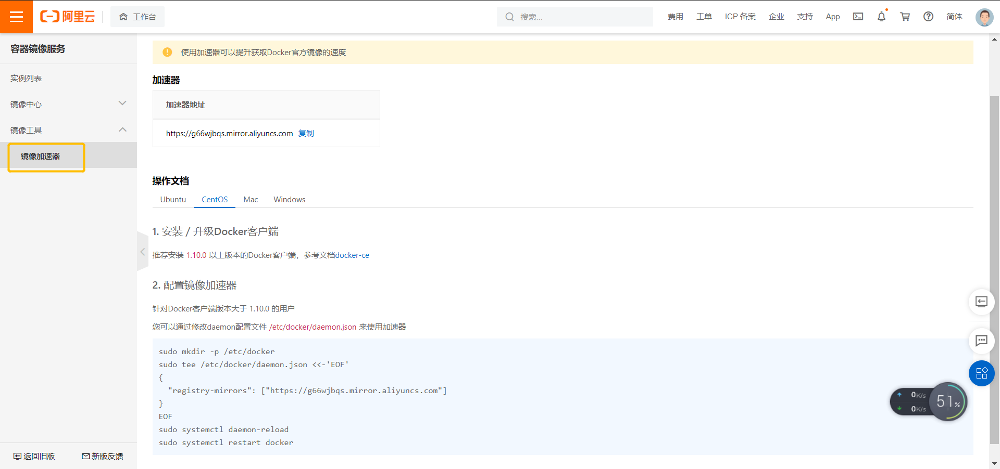

配置阿里的Docker镜像加速器

首先登录阿里云，获取镜像加速器地址

产品->容器与中间件->容器服务 ACK
 

管理控制台
 

镜像工具->镜像加速器
 


通过修改daemon配置文件/etc/docker/daemon.json来使用加速器
在etc目录下创建docker目录
```bash
sudo mkdir -p /etc/docker
```

创建配置文件写入加速器地址
```bash
sudo tee /etc/docker/daemon.json <<-'EOF'
{
  "registry-mirrors": ["https://g66wjbqs.mirror.aliyuncs.com"]
}
EOF
```

重新加载
```bash
sudo systemctl daemon-reload
```

重启Docker
```bash
sudo systemctl restart docker
```
        
