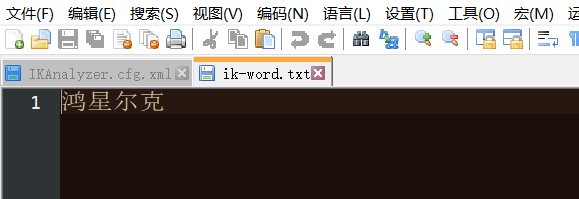

# 文档和索引

Elasticsearch 是一个分布式文档存储。Elasticsearch 不是将信息存储为列状数据的行，而是存储已序列化为 JSON 文档的复杂数据结构。当集群中有多个 Elasticsearch 节点时，存储的文档分布在整个集群中，并且可以从任何节点立即访问。


存储文档后，它会被编入索引，并且可以[近乎实时地进行](https://www.elastic.co/guide/en/elasticsearch/reference/current/near-real-time.html)全面搜索——在1 秒内。Elasticsearch 使用一种称为倒排索引的数据结构，它支持非常快速的全文搜索。倒排索引列出出现在任何文档中的每个唯一单词，并标识每个单词出现在的所有文档


索引可以被认为是文档的优化集合，每个文档都是字段的集合，这些字段是包含数据的键值对。默认情况下，Elasticsearch 索引每个字段中的所有数据，每个索引字段都有一个专用的、优化的数据结构。例如，文本字段存储在倒排索引中，数值和地理字段存储在 BKD 树中。使用每个字段的数据结构来组合和返回搜索结果的能力使 Elasticsearch 如此之快。

[ElasticSearch 7.5 官方文档](https://www.elastic.co/guide/en/elasticsearch/reference/7.5/elasticsearch-intro.html)

# 基本请求

Elasticsearch 提供了一个简单、一致的 REST API 来管理您的集群以及索引和搜索您的数据

## _cat 命令


查看所有节点
```bash
GET _cat/nodes
```

查看es健康状况
```bash
GET _cat/health
```

查看主节点
```bash
GET _cat/master
```

查看所有索引
```bash
GET _cat/indices
```


## POST和PUT

POST 可以添加和修改数据。当指定ID的时候，如果数据不存在则添加，存在则修改，如果不指定ID就是添加，会自动生成一个唯一ID

PUT 可以修改和添加数据。不指定ID会报错，所以一般PUT用于修改。


添加一个文档

```json
POST /person/_doc 	# POST /{index}/_doc/{id} #POST /{index}/_doc #POST /{index}/_create/{id}
{
  "id":1,
  "name":"cy-lemon",
  "age":22
}
```

```json
{
  "_index" : "person", # 数据的所在索引
  "_type" : "_doc", # 数据所在类型
  "_id" : "3Onn93sBHtr2zC8_QGi3", #数据的ID
  "_version" : 1,	# 数据版本
  "result" : "created", # 保存操作
  "_shards" : {		# 分片信息
    "total" : 2,
    "successful" : 1,
    "failed" : 0
  },
  "_seq_no" : 0,
  "_primary_term" : 1
}
```


**_upadte**

当POST更新文档加上_upadte，会检查文档是否发生变化，没有变化版本号就不会+1，

```bash
POST /person/_doc/1/_update
{
  "doc": { 	# 更新文档加上_update时就要 加上 doc
    "id": 2,
    "name": "cy-orange",
    "age": 20
  }
}
```

```json
{
  "_index" : "person",
  "_type" : "_doc",
  "_id" : "1",
  "_version" : 2,
  "result" : "noop", # 当更新文档加上_upadte，会检查文档是否发生变化
  "_shards" : {
    "total" : 0,
    "successful" : 0,
    "failed" : 0
  },
  "_seq_no" : 2,
  "_primary_term" : 1
}
```


## GET 查询文档

以ID查询文档 `GET /{index}/_doc/{id}`

```bash
GET /person/_doc/1
```

```json
{
  "_index" : "person",
  "_type" : "_doc",
  "_id" : "1",
  "_version" : 2,
  "_seq_no" : 2,	#并发控制字段，每次更新就会+1，用来做乐观锁
  "_primary_term" : 1,
  "found" : true,
  "_source" : {		#内容
    "id" : 2,
    "name" : "cy-orange",
    "age" : 20
  }
}
```


## DElETE 删除文档


```bash
DELETE /person/_doc/1
```

```json
{
  "_index" : "person",
  "_type" : "_doc",
  "_id" : "1",
  "_version" : 5,
  "result" : "deleted",
  "_shards" : {
    "total" : 2,
    "successful" : 1,
    "failed" : 0
  },
  "_seq_no" : 5,
  "_primary_term" : 1
}
```


## _bulk 批量操作

 添加多个文档

```json
POST /bank/_bulk
{"index":{"_id":"1"}}
{"account_number":1,"balance":39225,"firstname":"Amber","lastname":"Duke","age":32,"gender":"M","address":"880 Holmes Lane","employer":"Pyrami","email":"amberduke@pyrami.com","city":"Brogan","state":"IL"}
{"index":{"_id":"6"}}
{"account_number":6,"balance":5686,"firstname":"Hattie","lastname":"Bond","age":36,"gender":"M","address":"671 Bristol Street","employer":"Netagy","email":"hattiebond@netagy.com","city":"Dante","state":"TN"}

```


# Query DSL


基本语法

```json
GET /bank/_search
{
  "query": {
    "match_all": {} # 匹配全部
  },
  "sort": [		# 字段排序
    {
      "account_number": {
        "order": "asc"
      }
    }
  ],
  "from": 0, # 第几条开始
  "size": 5,  # 查询多少条
  "_source": ["account_number","firstname","lastname","balance"] # 要返回的字段
}
```


## Match query

分词匹配

```json
GET /bank/_search
{
  "query": {
    "match": {
      "account_number": 0
    }
  }
}
```


## Match phrase query

短语匹配

```json
GET /bank/_search
{
  "query": {
    "match_phrase": {
      "address": "282 Kings Place"
    }
  }
}
```


## Multi-match

多字段匹配，会分词

```json
GET /bank/_search
{
  "query": {
    "multi_match": {
      "query": "Ribera Kings",
      "fields": ["address","city"]
    }
  }
}
```


## bool

- must 满足，gender："M"并且 address："mill"
- must_not 不满足，age ！= 18
- should 希望满足，lastname=Wallace ，不满足也可以

```json
GET /bank/_search
{
  "query": {
    "bool": {
      "must": [
        {
          "match": {
            "gender": "M"
          }
        },
        {
          "match": {
            "address": "mill"
          }
        }
      ],
      "must_not": [
        {
          "match": {
            "age": "18"
          }
        }
      ],
      "should": [
        {
          "match": {
            "lastname": "Wallace"
          }
        }
      ]
    }
  }
}
```


filter 和 must 过滤

区别在于 filter不会计算相关性得分，must会计算相关性得分

must

```json
GET /bank/_search
{
  "query": {
    "bool": {
      "must": [
        {
          "range": {
            "age": {
              "gte": 18,
              "lte": 20
            }
          }
        }
      ]
    }
  }
}
```


filter

```json
GET /bank/_search
{
  "query": {
    "bool": {
      "filter": [
        {
          "range": {
            "age": {
              "gte": 18,
              "lte": 20
            }
          }
        }
      ]
    }
  }
}
```


## Term query


term 和 match 一样，匹配某个属性的值

全文检索字段使用match，其他非text字段匹配使用 term

term

```json
GET /bank/_search
{
  "query": {
    "term": {
      "balance": 39868
    }
  }
}
```


match

```json
GET /bank/_search
{
  "query": {
    "match": {
      "firstname": "Claudia"
    }
  }
}
```


# Aggregations聚合

聚合提供了从数据中分组和和提取数据的能力。最简单的聚合方法大致等于SQL FROUP BY和SQL聚合函数。

聚合分为三类：

- 从字段值中计算指标（如总和或平均值）的公制聚合值。
- 根据字段值、范围或其他标准将文档组组到存储桶（也称为"垃圾箱"）的桶聚合。
- 管道聚合，从其他聚合中而不是从文档或字段中接收输入。

聚合的基本结构：

```json
"aggregations" : {
    "<aggregation_name>" : {
        "<aggregation_type>" : {
            <aggregation_body>
        }
        [,"meta" : {  [<meta_data_body>] } ]?
        [,"aggregations" : { [<sub_aggregation>]+ } ]?
    }
    [,"<aggregation_name_2>" : { ... } ]*
}
```


案例：搜索address中包含maill的所有人的年龄分布以及平均年龄。但不显示这些人的详情。

```json
GET /bank/_search
{
  "query": {
    "match": {
      "address": "mill"
    }
  },
  "aggs": {
    "ageAgg": {
      "terms": {
        "field": "age",
        "size": 10  #比如有100种可能，从中选取前10种
      }
    }
  }
}
```

结果

```json
{
  "took" : 52,
  "timed_out" : false,
  "_shards" : {
    "total" : 1,
    "successful" : 1,
    "skipped" : 0,
    "failed" : 0
  },
  "hits" : {
    "total" : {
      "value" : 4,
      "relation" : "eq"
    },
    "max_score" : 5.4032025,
    "hits" : [
      {},
      {},
      {},
      {}
      }
    ]
  },
  "aggregations" : {
    "ageAgg" : {
      "doc_count_error_upper_bound" : 0,
      "sum_other_doc_count" : 0,
      "buckets" : [
        {
          "key" : 38,
          "doc_count" : 2
        },
        {
          "key" : 28,
          "doc_count" : 1
        },
        {
          "key" : 32,
          "doc_count" : 1
        }
      ]
    }
  }
}
```


# mapping映射

[映射|弹性搜索指南 7.5 |弹性的 (elastic.co)](https://www.elastic.co/guide/en/elasticsearch/reference/7.5/mapping.html)

映射是定义文档及其包含的字段如何存储和索引的过程。例如，使用映射来定义：

- 哪些字符串字段应视为全文字字段。
- 哪些字段包含数字、日期或地理位置。
- 日期值的[格式](https://www.elastic.co/guide/en/elasticsearch/reference/7.5/mapping-date-format.html)。
- 自定义规则，以控制[动态添加字段的](https://www.elastic.co/guide/en/elasticsearch/reference/7.5/dynamic-mapping.html)映射。

映射定义具有：

- [元字段](https://www.elastic.co/guide/en/elasticsearch/reference/7.5/mapping-fields.html)

  元字段用于自定义如何处理文档的元数据相关内容。元字段的例子包括文档[`的_index、_id`](https://www.elastic.co/guide/en/elasticsearch/reference/7.5/mapping-index-field.html)和[`_source`](https://www.elastic.co/guide/en/elasticsearch/reference/7.5/mapping-source-field.html)字段。

- [字段](https://www.elastic.co/guide/en/elasticsearch/reference/7.5/mapping-types.html)或属性

  映射包含与文档相关的字段列表。`properties`


可以使用创建索引API 创建具有明确映射的新索引。

创建，整数字段age
创建，关键字字段email
创建，文本字段name

```json
PUT /my-index
{
  "mappings": {
    "properties": {
      "age":    { "type": "integer" },
      "email":  { "type": "keyword"  },
      "name":   { "type": "text"  }
    }
  }
}
```


# Ik分词

ElasticSearch内置的分词器不能对中文进行分词，需要安装ik分词插件。

IK提供了两个分词算法：`ik_smart`和`ik_max_word`，其中`ik_smart`为最少切分，`ik_max_word`为最细粒度切分！

## 安装ik分词器插件

在GitHub上下载ElasticSearch版本对应的ik分词器：https://github.com/medcl/elasticsearch-analysis-ik/releases

然后在ElasticSearch安装目录下的plugins目录下创建ik目录，把ik分词器解压到ik目录，这样就完成了ik分词器的安装

测试，在kibana中运行如下例子

```json
POST _analyze
{
  "analyzer": "ik_max_word",
  "text": "今天天气真不错"
}
```

结果

```json
{
  "tokens" : [
    {
      "token" : "今天天气",
      "start_offset" : 0,
      "end_offset" : 4,
      "type" : "CN_WORD",
      "position" : 0
    },
    {
      "token" : "今天",
      "start_offset" : 0,
      "end_offset" : 2,
      "type" : "CN_WORD",
      "position" : 1
    },
    {
      "token" : "天天",
      "start_offset" : 1,
      "end_offset" : 3,
      "type" : "CN_WORD",
      "position" : 2
    },
    {
      "token" : "天气",
      "start_offset" : 2,
      "end_offset" : 4,
      "type" : "CN_WORD",
      "position" : 3
    },
    {
      "token" : "真不错",
      "start_offset" : 4,
      "end_offset" : 7,
      "type" : "CN_WORD",
      "position" : 4
    },
    {
      "token" : "真不",
      "start_offset" : 4,
      "end_offset" : 6,
      "type" : "CN_WORD",
      "position" : 5
    },
    {
      "token" : "不错",
      "start_offset" : 5,
      "end_offset" : 7,
      "type" : "CN_WORD",
      "position" : 6
    }
  ]
}
```

结果可以看到中文短语被分成一个个词语

## 自定义扩展词库

ik分词器只能拆分一些词语，如果是一些人名或者品牌的名字则会被拆分为一个个字，

例如：鸿星尔克球鞋

```json
POST _analyze
{
  "analyzer": "ik_max_word",
  "text": "鸿星尔克球鞋"
}
```

```json
{
  "tokens" : [
    {
      "token" : "鸿",
      "start_offset" : 0,
      "end_offset" : 1,
      "type" : "CN_CHAR",
      "position" : 0
    },
    {
      "token" : "星",
      "start_offset" : 1,
      "end_offset" : 2,
      "type" : "CN_CHAR",
      "position" : 1
    },
    {
      "token" : "尔",
      "start_offset" : 2,
      "end_offset" : 3,
      "type" : "CN_CHAR",
      "position" : 2
    },
    {
      "token" : "克",
      "start_offset" : 3,
      "end_offset" : 4,
      "type" : "CN_CHAR",
      "position" : 3
    },
    {
      "token" : "球鞋",
      "start_offset" : 4,
      "end_offset" : 6,
      "type" : "CN_WORD",
      "position" : 4
    }
  ]
}
```

可以看到，鸿星尔克被分为一个个字，想要实现这类关键字的分词， 需要给ik分词器自定义词库

首先需要一个词库用来存放关键词，然后给ik分词器配置词库的位置。可以使用Nignx来做词库

在Ningx的html目录中创建`ik-word.txt`文件，并写入关键词`鸿星尔克`

 


打开ik分词器插件目录下的`config/IKAnalyzer.cfg.xml`配置文件，配置远程词库的位置

```xml
<?xml version="1.0" encoding="UTF-8"?>
<!DOCTYPE properties SYSTEM "http://java.sun.com/dtd/properties.dtd">
<properties>
	<comment>IK Analyzer 扩展配置</comment>
	<!--用户可以在这里配置自己的扩展字典 -->
	<entry key="ext_dict"></entry>
	 <!--用户可以在这里配置自己的扩展停止词字典-->
	<entry key="ext_stopwords"></entry>
	<!--用户可以在这里配置远程扩展字典 -->
	<entry key="remote_ext_dict">http://localhost/ik-word.txt</entry>
	<!--用户可以在这里配置远程扩展停止词字典-->
	<!-- <entry key="remote_ext_stopwords">words_location</entry> -->
</properties>
```

配置好远程词库的位置之后，重启ElasticSearch

运行刚才的例子

```json
POST _analyze
{
  "analyzer": "ik_max_word",
  "text": "鸿星尔克球鞋"
}
```

```json
{
  "tokens" : [
    {
      "token" : "鸿星尔克",
      "start_offset" : 0,
      "end_offset" : 4,
      "type" : "CN_WORD",
      "position" : 0
    },
    {
      "token" : "球鞋",
      "start_offset" : 4,
      "end_offset" : 6,
      "type" : "CN_WORD",
      "position" : 1
    }
  ]
}
```

可看到`鸿星尔克`被分为一个词，自定义词库完成
        
