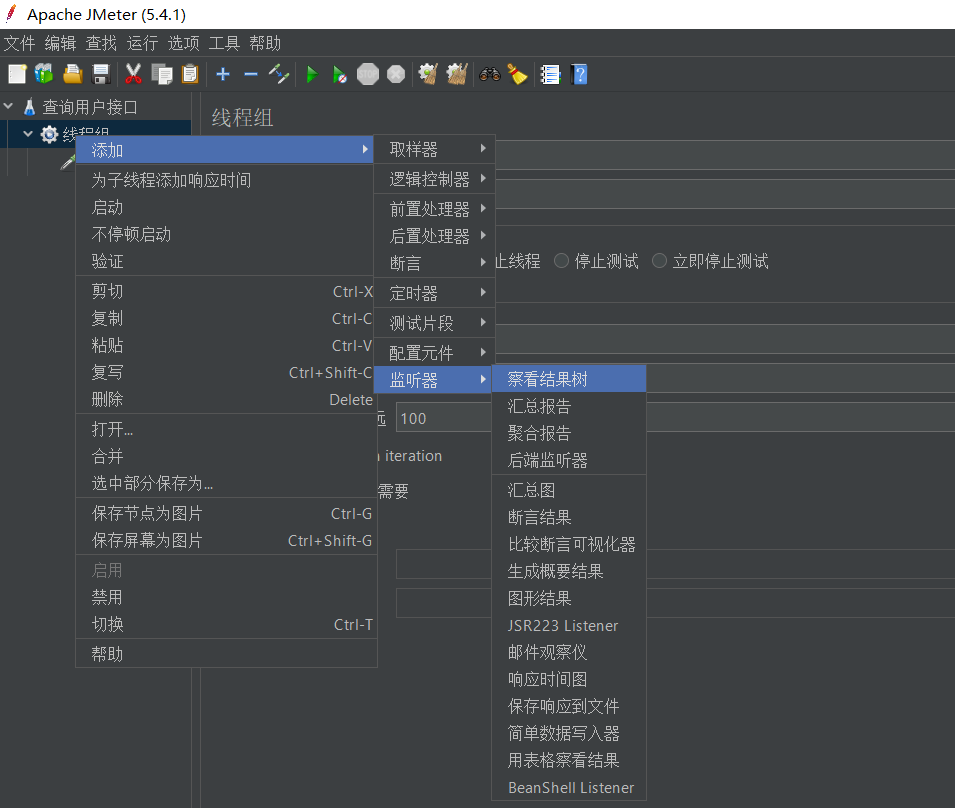

# 安装JMeter

下载JMeter对应的压缩包：[https://jmeter.apache.org/download_jmeter.cgi](https://jmeter.apache.org/download_jmeter.cgi)
 

解开压缩包，进入bin目录中双击`jmeter.bat` 就可以运行 JMeter
 

启动完成之后，会出现如下界面
 

JMeter支持语言设置，默认是英文，可以修改为中文
 

# 使用JMeter

## 测试计划
首先新建一个测试计划，点击左上角`文件 > 新建`
 

## 线程组
右键刚才新建的查询计划，添加线程组：
 

 在线程组中设置 线程数、Ramp-Up时间、循环次数，如下图所示：1秒钟启动200个线程循环100次，如果循环次数勾选了永远，需要点击上方的停止按钮
 

## HTTP请求
右键线程组，添加取样器为 HTTP请求
 

设置HTTP请求：协议、服务器名或IP、端口号、请求方式、路径、参数
 

## 察看结果树
右键线程组，添加监听器为结果树，结果树可以看到每一次请是成功还是失败，成功的响应结果。
 

结果树
 

## 汇总报告
右键线程组，添加监视器为汇总报告

汇总报告的个字段意思：
样本：一共发了多少个请求
平均值：平均每个请求的响应时间
最小值：最小响应时间
最大值：最大响应时间
标准偏差：表示请求的稳定性，值越大也不稳定，说明有的请求快，有的请求慢
异常：所有请求中发生异常的比例
吞吐量：衡量接口每秒可以处理多少个并发请求
接收：每秒接收的数据
发送：每秒发送的数据
 

最后就可以在HTTP请求中点击测试了
 
        
