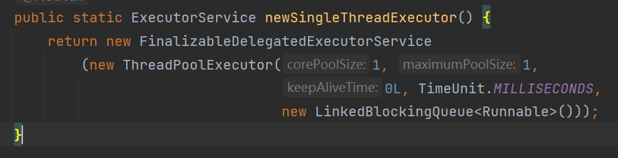

# 线程池的构造函数

```java
public ThreadPoolExecutor(int corePoolSize,
                          int maximumPoolSize,
                          long keepAliveTime,
                          TimeUnit unit,
                          BlockingQueue<Runnable> workQueue,
                          ThreadFactory threadFactory,
                          RejectedExecutionHandler handler)
```

## 构造函数的参数

`int corePoolSize`：保留在池中的线程数，即使它们是空闲的，除非设置了允许核心线程超时(allowCoreThreadTimeOut)
`int maximumPoolSize`：池中允许的最大线程数
`long keepAliveTime`：当线程数大于核心线程数时，这是空闲线程在终止前等待新任务的最大时间。（空闲线程的存活时间）
`TimeUnit unit`：keepAliveTime参数的时间单位
`BlockingQueue<Runnable> workQueue`：用来存放核心线程来不及处理的任务，默认值为Integer的最大值。
`ThreadFactory threadFactory`：执行程序创建新线程时使用的工厂
`RejectedExecutionHandler handler`：当执行被阻塞时使用的处理程序，因为线程边界和队列容量已经达到（当任务队列满了之后，按照指定的拒绝策略执行任务）

## 工作流程
1. 线程池创建，准备好指定数量的核心线程数，准备接收任务
2. 新的任务进来，用准备好的空闲线程执行。
3. 核心线程满了，就将再进来的任务放入阻塞队列中。空闲的核心线程就会去阻塞队列获取任务执行。
4. 阻塞队列满了，就直接开新线程执行，最大能开到maximumPoolSize指定的数量。
5. maximumPoolSize都执行好了，maximumPoolSize数量空闲的线程会在keepAliveTime指定的时间后自动销毁，最终保存核心线程
6. 如果线程数开到了maximumPoolSize数量，还有新任务进来，就会使用handler指定的拒绝策略进行处理


# 常见的四种线程池


## Executors.newCachedThreadPool()
带缓存的线程池，核心线程数为0，所有线程都可回收

使用的构造方法如下
```java
public static ExecutorService newCachedThreadPool() {
    return new ThreadPoolExecutor(0, Integer.MAX_VALUE,
                                  60L, TimeUnit.SECONDS,
                                  new SynchronousQueue<Runnable>());
}
```

## Executors.newFixedThreadPool()

固定线程数的线程池，所有线程都不可回收

使用的构造方法如下
```java
public static ExecutorService newFixedThreadPool(int nThreads) {
    return new ThreadPoolExecutor(nThreads, nThreads,
                                  0L, TimeUnit.MILLISECONDS,
                                  new LinkedBlockingQueue<Runnable>());
}
```

## Executors.newScheduledThreadPool()
定时任务的线程池

## Executors.newSingleThreadExecutor()
单线程的线程池，核心数是1，最大数也是1

使用的构造方法如下

 


# CompletableFuture异步编排

CompletableFuture主要是用于异步调用，内部封装了线程池，可以将请求或者处理过程，进行异步处理。

CompletableFuture提供了四个静态方法来创建异步操作
```java
//没有返回值
public static CompletableFuture<Void> runAsync(Runnable runnable) {
    return asyncRunStage(asyncPool, runnable);
}
//没有返回值，可指定线程池
public static CompletableFuture<Void> runAsync(Runnable runnable,
                                               Executor executor) {
    return asyncRunStage(screenExecutor(executor), runnable);
}

//有返回值
public static <U> CompletableFuture<U> supplyAsync(Supplier<U> supplier) {
    return asyncSupplyStage(asyncPool, supplier);
}
//有返回值，可指定线程池
public static <U> CompletableFuture<U> supplyAsync(Supplier<U> supplier,
                                                   Executor executor) {
    return asyncSupplyStage(screenExecutor(executor), supplier);
}
```

## 开启异步任务

```java
public static void main(String[] args) {
    //创建线程池
    ExecutorService executorService = Executors.newFixedThreadPool(10);
    //开启异步任务
    CompletableFuture<Integer> completableFuture = CompletableFuture.supplyAsync(() -> {
        int a = 1 + 1;
        return a;
    }, executorService);
    try {
        //获取返回结果
        Integer result = completableFuture.get();
        System.out.println("得到返回结果：" + result);
    } catch (InterruptedException e) {
        e.printStackTrace();
    } catch (ExecutionException e) {
        e.printStackTrace();
    }
}
```

## 任务完成回调和异常

whenComplete
```java
public static void main(String[] args) {
    //创建线程池
    ExecutorService executorService = Executors.newFixedThreadPool(10);
    //开启异步任务
    CompletableFuture<Integer> completableFuture = CompletableFuture.supplyAsync(() -> {
        int a = 1 / 0;
        return a;
    }, executorService).whenComplete((res, exception) -> {
        System.out.println("异步任务完成，结果为：" + res);
        System.out.println("异常是：" + exception);
    }).exceptionally(throwable -> {
        //当发生异常时，返回默认值
        return 0;
    });
    try {
        Integer result = completableFuture.get();
        System.out.println("结果为：" + result);
    } catch (InterruptedException e) {
        e.printStackTrace();
    } catch (ExecutionException e) {
        e.printStackTrace();
    }

}
```

handle
```java
public static void main(String[] args) {
    //创建线程池
    ExecutorService executorService = Executors.newFixedThreadPool(10);
    //开启异步任务
    CompletableFuture<Integer> completableFuture = CompletableFuture.supplyAsync(() -> {
        int a = 1 / 0;
        return a;
    }, executorService).handle((res, exception) -> {
        if (res != null) {
            return res * 2;
        }
        if (exception!=null){
            return 0;
        }
        return 0;
    });
    try {
        Integer result = completableFuture.get();
        System.out.println("结果为：" + result);
    } catch (InterruptedException e) {
        e.printStackTrace();
    } catch (ExecutionException e) {
        e.printStackTrace();
    }
}
```

## 线程串行化
- `thenRunAsync`：不能获取结果，没有返回值
- `thenAcceptAsync`：可以获取结果，没有返回值
- `thenApplyAsync `：可以获取结果，并且有返回值

thenRunAsync不能获取上一步的执行结果

例子
```java
public static void main(String[] args) {
    //创建线程池
    ExecutorService executorService = Executors.newFixedThreadPool(10);
    //开启异步任务
    CompletableFuture<Void> completableFuture = CompletableFuture.thenRunAsync(() -> {
        System.out.println("异步任务");
    }, executorService).thenRunAsync(() -> {
        System.out.println("任务二启动");
    }, executorService);
}
```

thenAcceptAsync 可以获取上一步的结果，但是没有返回值

例子
```java
public static void main(String[] args) {
    //创建线程池
    ExecutorService executorService = Executors.newFixedThreadPool(10);
    //开启异步任务
    CompletableFuture.supplyAsync(() -> {
        System.out.println("异步任务");
        int result = 1 + 1;
        return result;
    }, executorService).thenAcceptAsync(res -> {
        System.out.println("任务二启动，上一步的结果为：" + res);
    }, executorService);
}
```

thenApplyAsync 可以获取上一步的结果，还有返回值
例子
```java
public static void main(String[] args) {
    //创建线程池
    ExecutorService executorService = Executors.newFixedThreadPool(10);
    //开启异步任务
    CompletableFuture<Integer> completableFuture = CompletableFuture.supplyAsync(() -> {
        System.out.println("异步任务");
        int result = 1 + 1;
        return result;
    }, executorService).thenApplyAsync(res -> {
        System.out.println("任务二启动，上一步的结果为：" + res);
        return res * 2;
    }, executorService);

    try {
        Integer result = completableFuture.get();
        System.out.println("结果是：" + result);
    } catch (InterruptedException e) {
        e.printStackTrace();
    } catch (ExecutionException e) {
        e.printStackTrace();
    }
}
```

## 两任务组合

当任务一和任务二都完成再执行任务三
- `runAfterBothAsync `：不能获取前两个任务的结果，也没有返回值
- `thenAcceptBothAsync`：可以获取前两个任务的返回值，但是本身没有返回值
- `thenCombineAsync`：可以获取前两个任务的结果，还能返回值

两个任务，只要有一个任务完成，就执行任务三
- `runAfterEitherAsync`：不能获取前一个任务的结果，也没有返回值
- `acceptEitherAsync`：可以获取上一个任务的结果，但是没有返回值
- `applyToEitherAsync`：可以获取上一步的返回结果，并且有返回值


**runAfterBothAsync**
runAfterBothAsync不能获取前两个任务的结果，也没有返回值
例子
```java
public static void main(String[] args) {
    //创建线程池
    ExecutorService executorService = Executors.newFixedThreadPool(10);
    //开启异步任务1
    CompletableFuture<Integer> task = CompletableFuture.supplyAsync(() -> {
        System.out.println("异步任务1，当前线程是：" + Thread.currentThread().getId());
        int result = 1 + 1;
        System.out.println("异步任务1结束");
        return result;
    }, executorService);

    //开启异步任务2
    CompletableFuture<Integer> task2 = CompletableFuture.supplyAsync(() -> {
        System.out.println("异步任务2，当前线程是：" + Thread.currentThread().getId());
        int result = 1 + 1;
        System.out.println("异步任务2结束");
        return result;
    }, executorService);

    task.runAfterBothAsync(task2, () -> {
        System.out.println("任务3开始");
        System.out.println("任务三结束");
    }, executorService);
}
```

**thenAcceptBothAsync**
可以获取前两个任务的返回值，但是本身没有返回值
```java
public static void main(String[] args) {
    //创建线程池
    ExecutorService executorService = Executors.newFixedThreadPool(10);
    //开启异步任务1
    CompletableFuture<Integer> task = CompletableFuture.supplyAsync(() -> {
        System.out.println("异步任务1，当前线程是：" + Thread.currentThread().getId());
        int result = 1 + 1;
        System.out.println("异步任务1结束");
        return result;
    }, executorService);

    //开启异步任务2
    CompletableFuture<Integer> task2 = CompletableFuture.supplyAsync(() -> {
        System.out.println("异步任务2，当前线程是：" + Thread.currentThread().getId());
        int result = 1 + 1;
        System.out.println("异步任务2结束");
        return result;
    }, executorService);

    //任务组合
    task.thenAcceptBothAsync(task2, (f1, f2) -> {
        System.out.println("执行任务3，当前线程是：" + Thread.currentThread().getId());
        System.out.println("任务1返回值：" + f1);
        System.out.println("任务2返回值：" + f2);
    }, executorService);
}
```

**thenCombineAsync**
可以获取前两个任务的结果，还能返回值
```java
public static void main(String[] args) {
    //创建线程池
    ExecutorService executorService = Executors.newFixedThreadPool(10);
    //开启异步任务1
    CompletableFuture<Integer> task = CompletableFuture.supplyAsync(() -> {
        System.out.println("异步任务1，当前线程是：" + Thread.currentThread().getId());
        int result = 1 + 1;
        System.out.println("异步任务1结束");
        return result;
    }, executorService);

    //开启异步任务2
    CompletableFuture<Integer> task2 = CompletableFuture.supplyAsync(() -> {
        System.out.println("异步任务2，当前线程是：" + Thread.currentThread().getId());
        int result = 1 + 1;
        System.out.println("异步任务2结束");
        return result;
    }, executorService);

    //任务组合
    CompletableFuture<Integer> task3 = task.thenCombineAsync(task2, (f1, f2) -> {
        System.out.println("执行任务3，当前线程是：" + Thread.currentThread().getId());
        System.out.println("任务1返回值：" + f1);
        System.out.println("任务2返回值：" + f2);
        return f1 + f2;
    }, executorService);

    try {
        Integer res = task3.get();
        System.out.println("最终结果：" + res);
    } catch (InterruptedException e) {
        e.printStackTrace();
    } catch (ExecutionException e) {
        e.printStackTrace();
    }
}
```

**runAfterEitherAsync**
不能获取前一个任务的结果，也没有返回值
```java
public static void main(String[] args) {
    //创建线程池
    ExecutorService executorService = Executors.newFixedThreadPool(10);
    //开启异步任务1
    CompletableFuture<Integer> task = CompletableFuture.supplyAsync(() -> {
        System.out.println("异步任务1，当前线程是：" + Thread.currentThread().getId());
        int result = 1 + 1;
        System.out.println("异步任务1结束");
        return result;
    }, executorService);

    //开启异步任务2
    CompletableFuture<Integer> task2 = CompletableFuture.supplyAsync(() -> {
        System.out.println("异步任务2，当前线程是：" + Thread.currentThread().getId());
        int result = 1 + 1;
        System.out.println("异步任务2结束");
        return result;
    }, executorService);

    //任务组合
    task.runAfterEitherAsync(task2, () -> {
        System.out.println("执行任务3，当前线程是：" + Thread.currentThread().getId());
    }, executorService);
```

**acceptEitherAsync**
可以获取上一个任务的结果，但是没有返回值
```java
public static void main(String[] args) {
    //创建线程池
    ExecutorService executorService = Executors.newFixedThreadPool(10);
    //开启异步任务1
    CompletableFuture<Integer> task = CompletableFuture.supplyAsync(() -> {
        System.out.println("异步任务1，当前线程是：" + Thread.currentThread().getId());
        int result = 1 + 1;
        System.out.println("异步任务1结束");
        return result;
    }, executorService);

    //开启异步任务2
    CompletableFuture<Integer> task2 = CompletableFuture.supplyAsync(() -> {
        System.out.println("异步任务2，当前线程是：" + Thread.currentThread().getId());
        int result = 1 + 2;
        try {
            Thread.sleep(3000);
        } catch (InterruptedException e) {
            e.printStackTrace();
        }
        System.out.println("异步任务2结束");
        return result;
    }, executorService);

    //任务组合
    task.acceptEitherAsync(task2, (res) -> {
        System.out.println("执行任务3，当前线程是：" + Thread.currentThread().getId());
        System.out.println("上一个任务的结果为："+res);
    }, executorService);
}
```

**applyToEitherAsync**
可以获取上一步的返回结果，并且有返回值
```java
public static void main(String[] args) {
    //创建线程池
    ExecutorService executorService = Executors.newFixedThreadPool(10);
    //开启异步任务1
    CompletableFuture<Integer> task = CompletableFuture.supplyAsync(() -> {
        System.out.println("异步任务1，当前线程是：" + Thread.currentThread().getId());
        int result = 1 + 1;
        System.out.println("异步任务1结束");
        return result;
    }, executorService);

    //开启异步任务2
    CompletableFuture<Integer> task2 = CompletableFuture.supplyAsync(() -> {
        System.out.println("异步任务2，当前线程是：" + Thread.currentThread().getId());
        int result = 1 + 2;
        try {
            Thread.sleep(3000);
        } catch (InterruptedException e) {
            e.printStackTrace();
        }
        System.out.println("异步任务2结束");
        return result;
    }, executorService);

    //任务组合
    CompletableFuture<Integer> task3 = task.applyToEitherAsync(task2, (res) -> {
        System.out.println("执行任务3，当前线程是：" + Thread.currentThread().getId());
        System.out.println("上一个任务的结果为：" + res);
        return res * 3;
    }, executorService);

    try {
        Integer res = task3.get();
        System.out.println("最终结果：" + res);
    } catch (InterruptedException e) {
        e.printStackTrace();
    } catch (ExecutionException e) {
        e.printStackTrace();
    }
}
```

## 多任务组合
- `allOf`：等待所有任务完成
- `anyOf`：只要有一个任务完成

**allOf**
等待所有任务完成
```java
public static void main(String[] args) {
    //创建线程池
    ExecutorService executorService = Executors.newFixedThreadPool(10);
    //开启异步任务1
    CompletableFuture<Integer> task = CompletableFuture.supplyAsync(() -> {
        System.out.println("异步任务1，当前线程是：" + Thread.currentThread().getId());
        int result = 1 + 1;
        System.out.println("异步任务1结束");
        return result;
    }, executorService);

    //开启异步任务2
    CompletableFuture<Integer> task2 = CompletableFuture.supplyAsync(() -> {
        System.out.println("异步任务2，当前线程是：" + Thread.currentThread().getId());
        int result = 1 + 2;
        try {
            Thread.sleep(3000);
        } catch (InterruptedException e) {
            e.printStackTrace();
        }
        System.out.println("异步任务2结束");
        return result;
    }, executorService);

    //开启异步任务3
    CompletableFuture<Integer> task3 = CompletableFuture.supplyAsync(() -> {
        System.out.println("异步任务3，当前线程是：" + Thread.currentThread().getId());
        int result = 1 + 3;
        try {
            Thread.sleep(4000);
        } catch (InterruptedException e) {
            e.printStackTrace();
        }
        System.out.println("异步任务3结束");
        return result;
    }, executorService);

    //任务组合
    CompletableFuture<Void> allOf = CompletableFuture.allOf(task, task2, task3);
    try {
        //等待所有任务完成
        allOf.get();

        //获取任务的返回结果
        System.out.println("task结果为：" + task.get());
        System.out.println("task2结果为：" + task2.get());
        System.out.println("task3结果为：" + task3.get());
    } catch (InterruptedException e) {
        e.printStackTrace();
    } catch (ExecutionException e) {
        e.printStackTrace();
    }

}
```

**anyOf**
只要有一个任务完成
```java
public static void main(String[] args) {
    //创建线程池
    ExecutorService executorService = Executors.newFixedThreadPool(10);
    //开启异步任务1
    CompletableFuture<Integer> task = CompletableFuture.supplyAsync(() -> {
        System.out.println("异步任务1，当前线程是：" + Thread.currentThread().getId());
        int result = 1 + 1;
        System.out.println("异步任务1结束");
        return result;
    }, executorService);

    //开启异步任务2
    CompletableFuture<Integer> task2 = CompletableFuture.supplyAsync(() -> {
        System.out.println("异步任务2，当前线程是：" + Thread.currentThread().getId());
        int result = 1 + 2;
        try {
            Thread.sleep(3000);
        } catch (InterruptedException e) {
            e.printStackTrace();
        }
        System.out.println("异步任务2结束");
        return result;
    }, executorService);

    //开启异步任务3
    CompletableFuture<Integer> task3 = CompletableFuture.supplyAsync(() -> {
        System.out.println("异步任务3，当前线程是：" + Thread.currentThread().getId());
        int result = 1 + 3;
        try {
            Thread.sleep(4000);
        } catch (InterruptedException e) {
            e.printStackTrace();
        }
        System.out.println("异步任务3结束");
        return result;
    }, executorService);

    //任务组合
    CompletableFuture<Object> anyOf = CompletableFuture.anyOf(task, task2, task3);
    try {
        //只要有一个有任务完成
        Object o = anyOf.get();
        System.out.println("完成的任务的结果：" + o);
    } catch (InterruptedException e) {
        e.printStackTrace();
    } catch (ExecutionException e) {
        e.printStackTrace();
    }
}
```
