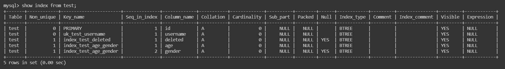

## 索引分类
唯一索引：索引列的值必须唯一，但是允许有多个`null`值
单值索引：一个索引只包含单个列，一个表中可以有多个单值索引
符合索引：一个索引包含多个列

## 创建索引


首先创建一张测试表
```sql
CREATE TABLE if not exists `test` (
    `id` BIGINT NOT NULL COMMENT 'id',
    `username` VARCHAR(100) NOT NULL COMMENT '用户名',
    `age` TINYINT not null COMMENT '年龄',
    `gender` TINYINT(1) DEFAULT 0 COMMENT '性别：0-男，1-女',
    `deleted` TINYINT(1) DEFAULT 0 COMMENT '0-未删除，1-已删除',
    PRIMARY KEY (`id`)
  ) ENGINE = InnoDB DEFAULT CHARSET = utf8mb4 COLLATE = utf8mb4_0900_ai_ci COMMENT = '测试表';
```
唯一索引：给`username`字段创建唯一索引
```sql
CREATE UNIQUE INDEX uk_test_username ON test(username);
```

单值索引：给`deleted`字段创建单值索引
```sql
`CREATE INDEX index_test_deleted ON test(deleted);`
```

复合索引：给`age` 和 `gender` 字段创建复合索引
```sql
`create INDEX index_test_age_gender ON test(age,gender);`
```
## 查看索引
show index from tableName;
```sql
mysql> show index from test;
+-------+------------+-----------------------+--------------+-------------+-----------+-------------+----------+--------+------+------------+---------+---------------+---------+------------+
| Table | Non_unique | Key_name              | Seq_in_index | Column_name | Collation | Cardinality | Sub_part | Packed | Null | Index_type | Comment | Index_comment | Visible | Expression |
+-------+------------+-----------------------+--------------+-------------+-----------+-------------+----------+--------+------+------------+---------+---------------+---------+------------+
| test  |          0 | PRIMARY               |            1 | id          | A         |           0 |     NULL |   NULL |      | BTREE      |         |               | YES     | NULL       |
| test  |          0 | uk_test_username      |            1 | username    | A         |           0 |     NULL |   NULL |      | BTREE      |         |               | YES     | NULL       |
| test  |          1 | index_test_deleted    |            1 | deleted     | A         |           0 |     NULL |   NULL | YES  | BTREE      |         |               | YES     | NULL       |
| test  |          1 | index_test_age_gender |            1 | age         | A         |           0 |     NULL |   NULL |      | BTREE      |         |               | YES     | NULL       |
| test  |          1 | index_test_age_gender |            2 | gender      | A         |           0 |     NULL |   NULL | YES  | BTREE      |         |               | YES     | NULL       |
+-------+------------+-----------------------+--------------+-------------+-----------+-------------+----------+--------+------+------------+---------+---------------+---------+------------+
5 rows in set (0.00 sec)
```

 

## 删除索引
DROP INDEX indexName ON tableName;

```SQL
DROP index uk_test_username on test;
```
