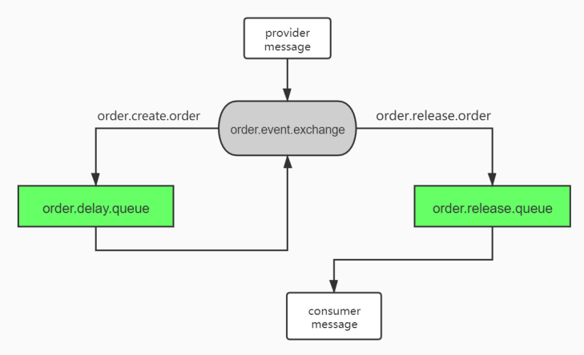

使用RabbitMQ的作为延时队列，模拟订单超时，解锁库存。

RabbitMQ没有延迟队列，可以用死信队列+普通队列来完成延迟队列的功能。

1. 消息发给交`order.event.exchange`交换机，交换机使用`order.create.order`路由键将消息发给`order.delay.queue`死信队列
2. 死信队列中的消息过期之后，使用`order.event.exchange`交换机和`order.create.order`路由键将消息发给`order.release.queue`队列

 


创建Spring Boot项目，添加依赖

```xml
<?xml version="1.0" encoding="UTF-8"?>
<project xmlns="http://maven.apache.org/POM/4.0.0" xmlns:xsi="http://www.w3.org/2001/XMLSchema-instance" xsi:schemaLocation="http://maven.apache.org/POM/4.0.0 https://maven.apache.org/xsd/maven-4.0.0.xsd">
    <modelVersion>4.0.0</modelVersion>
    <parent>
        <groupId>org.springframework.boot</groupId>
        <artifactId>spring-boot-starter-parent</artifactId>
        <version>2.3.12.RELEASE</version>
        <relativePath/> <!-- lookup parent from repository -->
    </parent>
    <groupId>com.orange</groupId>
    <artifactId>demo-rabbit-order</artifactId>
    <version>0.0.1-SNAPSHOT</version>
    <properties>
        <java.version>1.8</java.version>
    </properties>
    <dependencies>
        <dependency>
            <groupId>org.springframework.boot</groupId>
            <artifactId>spring-boot-starter-web</artifactId>
        </dependency>

        <dependency>
            <groupId>org.springframework.boot</groupId>
            <artifactId>spring-boot-starter-amqp</artifactId>
        </dependency>

        <dependency>
            <groupId>org.projectlombok</groupId>
            <artifactId>lombok</artifactId>
            <optional>true</optional>
        </dependency>
        <dependency>
            <groupId>org.springframework.boot</groupId>
            <artifactId>spring-boot-starter-test</artifactId>
            <scope>test</scope>
        </dependency>
    </dependencies>

    <build>
        <plugins>
            <plugin>
                <groupId>org.springframework.boot</groupId>
                <artifactId>spring-boot-maven-plugin</artifactId>
                <configuration>
                    <excludes>
                        <exclude>
                            <groupId>org.projectlombok</groupId>
                            <artifactId>lombok</artifactId>
                        </exclude>
                    </excludes>
                </configuration>
            </plugin>
        </plugins>
    </build>
</project>

```


application.yml中配置RabbitMQ的信息

```yaml
spring:
  rabbitmq:
    host: localhost
    port: 5672
    virtual-host: /
```


定义常量：队列、交换机、路由

```java
package com.orange.rabbitorder.constant;

import lombok.Getter;

@Getter
public enum MQEnum {
    ORDER_DELAY_QUEUE("order.delay.queue","order.event.exchange","order.create.order"),
    ORDER_RELEASE_QUEUE("order.release.queue","order.event.exchange","order.release.order")
    ;

    private String queue;
    private String exchange;
    private String routingKye;

    MQEnum(String queue, String exchange, String routingKye) {
        this.queue = queue;
        this.exchange = exchange;
        this.routingKye = routingKye;
    }
}
```


创建队列、交换机、路由和绑定关系

```java
package com.orange.rabbitorder.config;

import com.orange.rabbitorder.constant.MQEnum;
import org.springframework.amqp.core.Binding;
import org.springframework.amqp.core.Exchange;
import org.springframework.amqp.core.Queue;
import org.springframework.amqp.core.TopicExchange;
import org.springframework.amqp.support.converter.Jackson2JsonMessageConverter;
import org.springframework.amqp.support.converter.MessageConverter;
import org.springframework.context.annotation.Bean;
import org.springframework.context.annotation.Configuration;

import java.util.HashMap;

@Configuration
public class RabbitMQConfig {

    /**
     * 设置消息序列化为json格式传输
     *
     * @return
     */
    @Bean
    public MessageConverter messageConverter() {
        return new Jackson2JsonMessageConverter();
    }

    @Bean
    public Queue orderDelayQueue() {
        /**
         * 创建队列的构造方法
         * Queue(String name, boolean durable, boolean exclusive, boolean autoDelete, @Nullable Map<String, Object> arguments)
         * name：队列的名字
         * durable：是否持久化
         * exclusive：是否排他
         * autoDelete：是否自动删除
         * arguments：自定义属性
         */
        HashMap<String, Object> arguments = new HashMap<>();
        arguments.put("x-dead-letter-exchange", MQEnum.ORDER_DELAY_QUEUE.getExchange());
        arguments.put("x-dead-letter-routing-key", MQEnum.ORDER_RELEASE_QUEUE.getRoutingKye());
        arguments.put("x-message-ttl", 60000);//单位毫秒
        Queue queue = new Queue(MQEnum.ORDER_DELAY_QUEUE.getQueue(), true, false, false, arguments);
        return queue;
    }

    @Bean
    public Queue orderReleaseQueue() {
        Queue queue = new Queue(MQEnum.ORDER_RELEASE_QUEUE.getQueue(), true, false, false);
        return queue;
    }

    @Bean
    public Exchange orderEventExchange() {
        return new TopicExchange(MQEnum.ORDER_RELEASE_QUEUE.getExchange(), true, false);
    }

    @Bean
    public Binding orderCreateOrderBinding() {
        return new Binding(MQEnum.ORDER_DELAY_QUEUE.getQueue(),
                Binding.DestinationType.QUEUE,
                MQEnum.ORDER_DELAY_QUEUE.getExchange(),
                MQEnum.ORDER_DELAY_QUEUE.getRoutingKye(),
                null);
    }

    @Bean
    public Binding orderOrderBinding() {
        return new Binding(MQEnum.ORDER_RELEASE_QUEUE.getQueue(),
                Binding.DestinationType.QUEUE,
                MQEnum.ORDER_RELEASE_QUEUE.getExchange(),
                MQEnum.ORDER_RELEASE_QUEUE.getRoutingKye(),
                null);
    }
}
```


发送消息

```java
@RestController
@RequestMapping("order")
public class OrderController {

    @Autowired
    private RabbitTemplate rabbitTemplate;

    @RequestMapping("createOrder")
    public String createOrder() {
        //创建订单
        //扣减库存
        // 下单成功
        //给mq发消息
        SkuStockDO skuStockDO = new SkuStockDO();
        skuStockDO.setId(123L);
        skuStockDO.setSkuId(1L);
        skuStockDO.setNumber(2);
        rabbitTemplate.convertAndSend(MQEnum.ORDER_DELAY_QUEUE.getExchange(),
                MQEnum.ORDER_DELAY_QUEUE.getRoutingKye(),
                skuStockDO);
        return "下单成功";
    }

}
```


监听消息

```java
package com.orange.rabbitorder.service;

import com.orange.rabbitorder.dataobject.SkuStockDO;
import com.rabbitmq.client.Channel;
import org.springframework.amqp.core.Message;
import org.springframework.amqp.rabbit.annotation.RabbitListener;
import org.springframework.stereotype.Service;


@Service
public class StockService {

    @RabbitListener(queues = {"order.release.queue"})
    public void dcrStock(Message message, SkuStockDO skuStockDO, Channel channel) {
        System.out.println("收到超时的订单，解锁库存：" + skuStockDO);
        System.out.println("解锁库存成功");
    }
}

```
        
