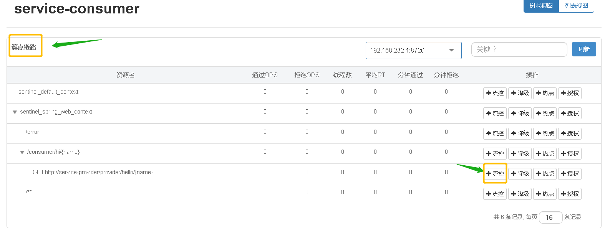
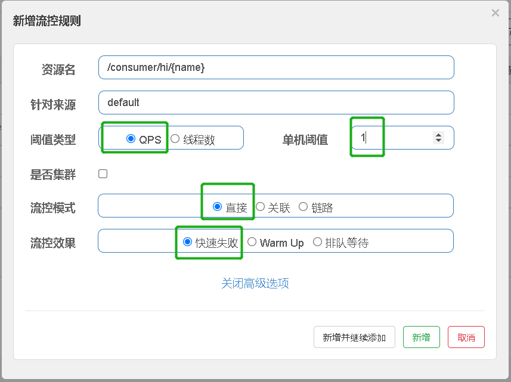
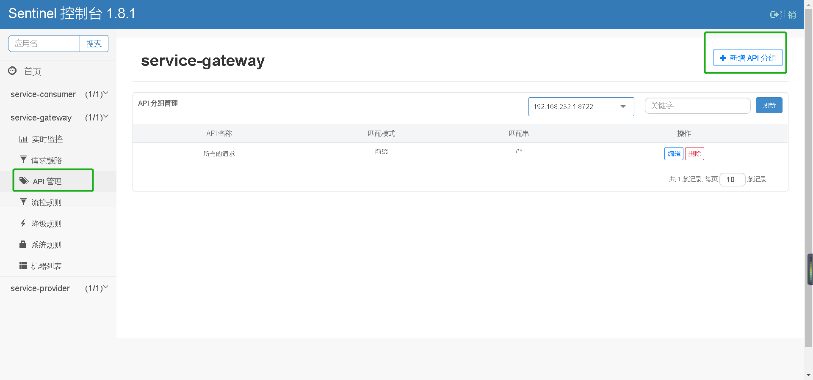
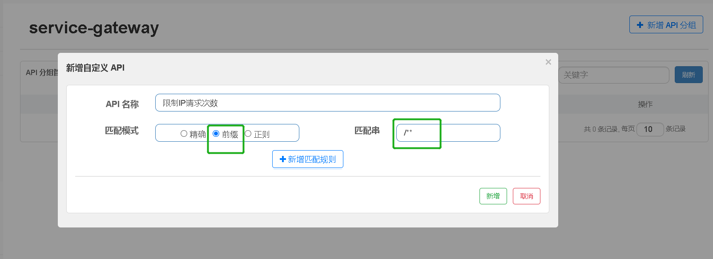
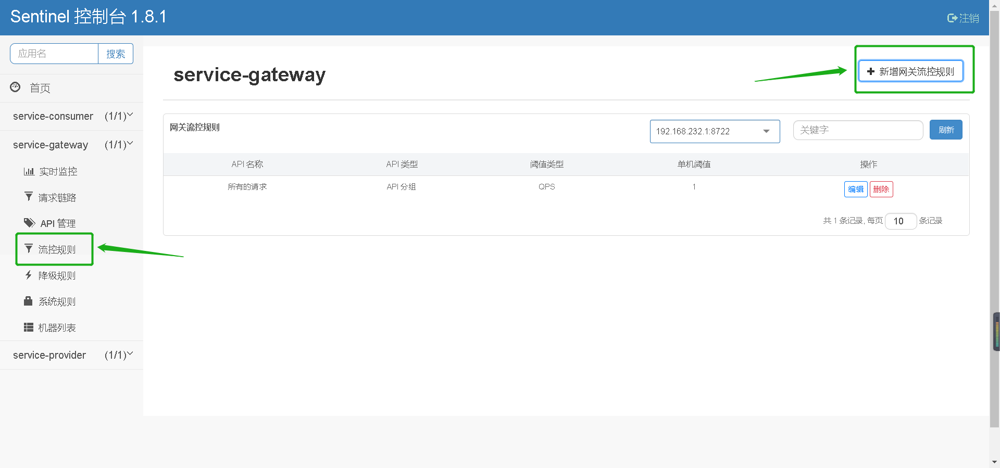
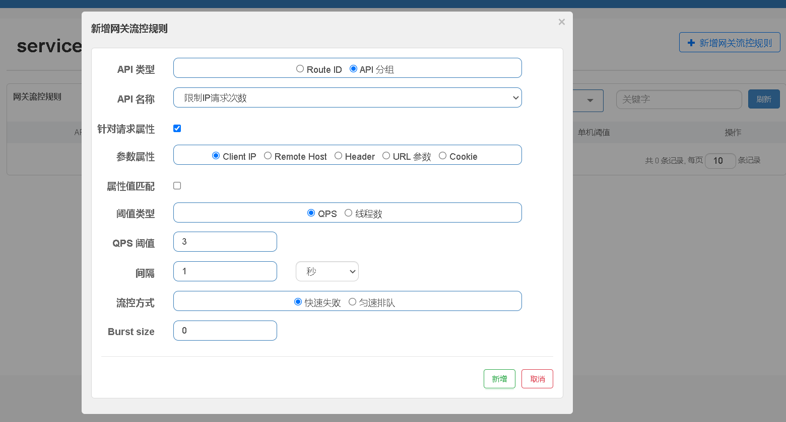

# Spring Cloud Alibaba

Spring Cloud Alibaba 致力于提供微服务开发的一站式解决方案。此项目包含开发分布式应用微服务的必需组件，方便开发者通过 Spring Cloud 编程模型轻松使用这些组件来开发分布式应用服务。

引入依赖，在 `dependencyManagement` 中添加如下配置。

```
<dependencyManagement>
    <dependencies>
        <dependency>
            <groupId>com.alibaba.cloud</groupId>
            <artifactId>spring-cloud-alibaba-dependencies</artifactId>
            <version>2.2.6.RELEASE</version>
            <type>pom</type>
            <scope>import</scope>
        </dependency>
    </dependencies>
</dependencyManagement>
```

# Nacos 服务注册与发现

Nacos 是阿里巴巴开源的一个更易于构建云原生应用的动态服务发现、配置管理和服务管理平台。

首先需要获取 Nacos Server，[Nacos Server 下载页](https://github.com/alibaba/nacos/releases)

修改 pom.xml 文件，引入 Nacos Discovery Starter。
```xml
 <dependency>
     <groupId>com.alibaba.cloud</groupId>
     <artifactId>spring-cloud-starter-alibaba-nacos-discovery</artifactId>
 </dependency>
```


在配置文件中配置 Nacos Server 地址
```yaml
server:
  port: 8082

spring:
  application:
    name: service-provider
  cloud:
    nacos:
      server-addr: 127.0.0.1:8848
```


使用 @EnableDiscoveryClient 注解开启服务注册与发现功能
```java
 @SpringBootApplication
 @EnableDiscoveryClient
 public class ProviderApplication {

 	public static void main(String[] args) {
 		SpringApplication.run(ProviderApplication.class, args);
 	}
 }
```


# Nacos 分布式配置管理

首先，修改 pom.xml 文件，引入 Nacos Config Starter。
```xml
 <dependency>
     <groupId>com.alibaba.cloud</groupId>
     <artifactId>spring-cloud-starter-alibaba-nacos-config</artifactId>
 </dependency>
```


在应用的 `/src/main/resources/bootstrap.yml` 配置文件中配置 Nacos Config 元数据
```yaml
spring:
  application:
    name: service-provider

  cloud:
    nacos:
      config:
        server-addr: 127.0.0.1:8848
        namespace: d1c63875-be0c-46db-81d5-bd037567f9c1
        file-extension: yaml
```


完成上述两步后，应用会从 Nacos Config 中获取相应的配置，并添加在 Spring Environment 的 PropertySources 中。这里我们使用 [@Value ](/Value ) 注解来将对应的配置注入到 SampleController 的 userName 和 age 字段，并添加 [@RefreshScope ](/RefreshScope ) 打开动态刷新功能
```java
 @RefreshScope
 class SampleController {

 	@Value("${user.name}")
 	String userName;

 	@Value("${user.age}")
 	int age;
 }
```


在Nacos控制台的配置列表中添加配置，Data ID: service-provider.yaml，Group: DEFAULT_GROUP，内容如下
```yaml
user:
  name: orange
  age: 23
```


# OpenFeign 服务调用

OpenFeign 是Spring Cloud 的组件，所以要加入spring cloud 的依赖管理

```xml
<dependencyManagement>
    <dependencies>
        <dependency>
            <groupId>com.alibaba.cloud</groupId>
            <artifactId>spring-cloud-alibaba-dependencies</artifactId>
            <version>2.2.6.RELEASE</version>
            <type>pom</type>
            <scope>import</scope>
        </dependency>

        <dependency>
            <groupId>org.springframework.cloud</groupId>
            <artifactId>spring-cloud-dependencies</artifactId>
            <version>Hoxton.SR12</version>
            <type>pom</type>
            <scope>import</scope>
        </dependency>
    </dependencies>
</dependencyManagement>
```

Nacos Discovery Starter 默认集成了 Ribbon ，所以对于使用了 Ribbon 做负载均衡的组件，可以直接使用 Nacos 的服务发现。

首先，修改 pom.xml 文件，引入 OpenFeign Starter。
```xml
<dependency>
    <groupId>org.springframework.cloud</groupId>
    <artifactId>spring-cloud-starter-openfeign</artifactId>
</dependency>
```


使用注解 `@EnableFeignClients` 开启服务调用
```java
@EnableFeignClients
@EnableDiscoveryClient
@SpringBootApplication
public class ConsumerApplication {

    public static void main(String[] args) {
        SpringApplication.run(ConsumerApplication.class, args);
    }

}
```


FeignClient 已经默认集成了 Ribbon ，此处演示如何配置一个 FeignClient。
```java
 @FeignClient(name = "service-provider")
 public interface EchoService {
     @GetMapping(value = "/echo/{str}")
     String echo(@PathVariable("str") String str);
 }
```


# Gateway 网关

简单使用

修改 pom.xml 文件，引入 Sentinel Starter

```xml
<dependency>
    <groupId>org.springframework.cloud</groupId>
    <artifactId>spring-cloud-starter-gateway</artifactId>
</dependency>
```

网关配置

```yaml
server:
  port: 8080

spring:
  application:
    name: service-gateway

  cloud:
    nacos:
      discovery:
        server-addr: 127.0.0.1:8848

    gateway:
      routes:
        - id: service-provider
          uri: lb://service-provider
          predicates:
            - Path=/provider/**
        - id: service-consumer
          uri: lb://service-consumer
          predicates:
            - Path=/consumer/**
```


# Sentinel 流量控制、熔断降级

随着微服务的流行，服务和服务之间的稳定性变得越来越重要。Sentinel 以流量为切入点，从流量控制、熔断降级、系统负载保护等多个维度保护服务的稳定性。

如何在Spring Cloud Alibaba中使用Sentinel

1. 首先下载 Sentinel 控制台 jar 包：https://github.com/alibaba/Sentinel/releases
启动Sentinel控制台
```
java -jar sentinel-dashboard-1.8.1.jar --server.port=9090
```
访问localhost:9090，默认用户名密码都是sentinel


2. 修改 pom.xml 文件，引入 Sentinel Starter
```xml
<dependency>
    <groupId>com.alibaba.cloud</groupId>
    <artifactId>spring-cloud-starter-alibaba-sentinel</artifactId>
</dependency>
```

3. 配置 Sentinel 控制台地址信息
application.yml
```
spring:
  cloud:
    sentinel:
      transport:
        port: 8719
        dashboard: localhost:9090
```
这里的 `spring.cloud.sentinel.transport.port` 端口配置会在应用对应的机器上启动一个 Http Server，该 Server 会与 Sentinel 控制台做交互。比如 Sentinel 控制台添加了一个限流规则，会把规则数据 push 给这个 Http Server 接收，Http Server 再将规则注册到 Sentinel 中。


## sentinel 流量控制

给请求上流控规则
比如现在有个资源路径 `GET:http://service-provider/provider/hello/{name}`，设置每秒只接收一个请求
 
 

访问这个加上流控规则的路径时，每秒大于一个请求就会返回失败信息
 

这个时sentinel默认的返回信息，可以自定返回信息
```java
@Configuration
public class SentinelConfig {

    @Bean
    public BlockExceptionHandler blockExceptionHandler() {
        return new BlockExceptionHandler() {
            @Override
            public void handle(HttpServletRequest httpServletRequest, HttpServletResponse httpServletResponse, BlockException e) throws Exception {
                httpServletResponse.setContentType("application/json;charset=utf-8");
                ResponseData responseData = new ResponseData(5001, "活动火爆，请稍后再试");
                String s = new ObjectMapper().writeValueAsString(responseData);
                httpServletResponse.getWriter().write(s);
            }
        };
    }

}
```

## Sentinel 支持 Endpoint

在使用 Endpoint 特性之前需要在 Maven 中添加 spring-boot-starter-actuator 依赖，并在配置中允许 Endpoints 的访问。

Spring Boot 1.x 中添加配置 `management.security.enabled=false`。暴露的 endpoint 路径为 `/sentinel`

Spring Boot 2.x 中添加配置 `management.endpoints.web.exposure.include=*`。暴露的 endpoint 路径为 `/actuator/sentinel`

Sentinel Endpoint 里暴露的信息非常有用。包括当前应用的所有规则信息、日志目录、当前实例的 IP，Sentinel Dashboard 地址，Block Page，应用与 Sentinel Dashboard 的心跳频率等等信息。

## Sentinel支持Feign服务熔断

Sentinel 适配了 Feign 组件。如果想使用，除了引入 `spring-cloud-starter-alibaba-sentinel`，只需要在配置文件打开 Sentinel 对 Feign 的支持
```yaml
feign:
  sentinel:
    enabled: true
```


```java
@FeignClient(value = "service-provider",fallback = ProviderOuterServiceFallback.class)
public interface ProviderOuterService {

    @GetMapping("provider/hello/{name}")
    String hello(@PathVariable String name);
}
```

```java
@Component
public class ProviderOuterServiceFallback implements ProviderOuterService {
    @Override
    public String hello(String name) {
        return "系统错误";
    }
}
```


## Sentinel-Gateway网关限流

从 1.6.0 版本开始，Sentinel 提供了 Spring Cloud Gateway 的适配模块，可以提供两种资源维度的限流：

- route 维度：即在 Spring 配置文件中配置的路由条目，资源名为对应的 routeId
- 自定义 API 维度：用户可以利用 Sentinel 提供的 API 来自定义一些 API 分组

使用时在网关服务添加sentinel适配gateway的依赖

```xml
<dependency>
	<groupId>com.alibaba.cloud</groupId>
	<artifactId>spring-cloud-alibaba-sentinel-gateway</artifactId>
</dependency>
```

来个使用案例，所有的请求都会经过网关服务，限制每个IP每秒最多能请求三次；
API管理 > 新增API分组
 
匹配串`/**` 表示所有的请求
 

流控规则 > 新增网关流控规则
 
 

当单个相同的IP每秒请求次数超过3次就会返回失败信息
 

这个是Sentinel默认的返回信息，可以自定义
```java
@Configuration
public class SentinelGatewayConfig {

    @Bean
    public BlockRequestHandler blockRequestHandler() {
        return new BlockRequestHandler() {
            @Override
            public Mono<ServerResponse> handleRequest(ServerWebExchange serverWebExchange, Throwable throwable) {
                ResponseData responseData = new ResponseData(4001, "请稍后再试");
                String res = null;
                try {
                    res = new ObjectMapper().writeValueAsString(responseData);
                } catch (JsonProcessingException e) {
                    e.printStackTrace();
                }
                Mono<ServerResponse> body = ServerResponse.ok().body(Mono.just(res), String.class);
                return body;
            }
        };
    }
}
```
        
