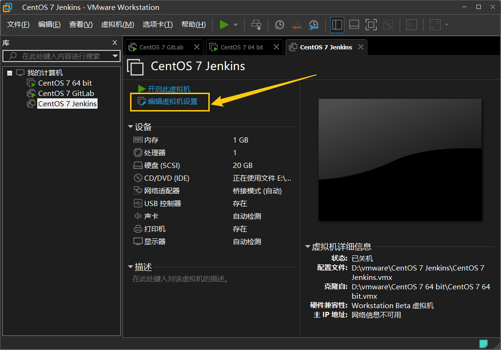
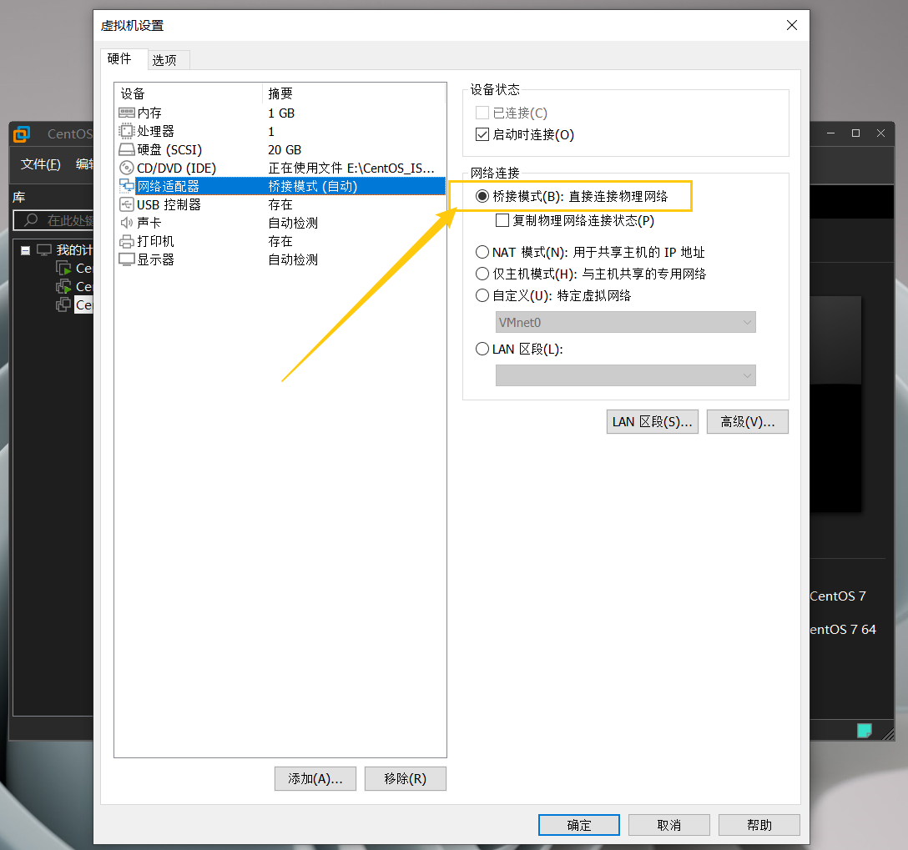

修改VMware网络配置
编辑 >虚拟网络编辑器


编辑虚拟机设置


网络适配器选择桥接模式



查看主机网关 `ipconfig`


修改CentOS网络配置，网关和主机网关一致，IP地址和主机在同一个网段 `vim /etc/sysconfig/network-scripts/ifcfg-ens33`  ``` TYPE=Ethernet PROXY_METHOD=none BROWSER_ONLY=no BOOTPROTO=static DEFROUTE=yes IPV4_FAILURE_FATAL=no IPV6INIT=yes IPV6_AUTOCONF=yes IPV6_DEFROUTE=yes IPV6_FAILURE_FATAL=no NAME=enp0s3 UUID=eae5023a-eec6-47ef-8213-8ecba2b2ba99 DEVICE=enp0s3 ONBOOT=yes IPADDR=192.168.1.119 GATEWAY=192.168.1.1 NETMASK=255.255.255.0 DNS1=8.8.8.8

```

重启网络：`systemctl restart network.service`
        
