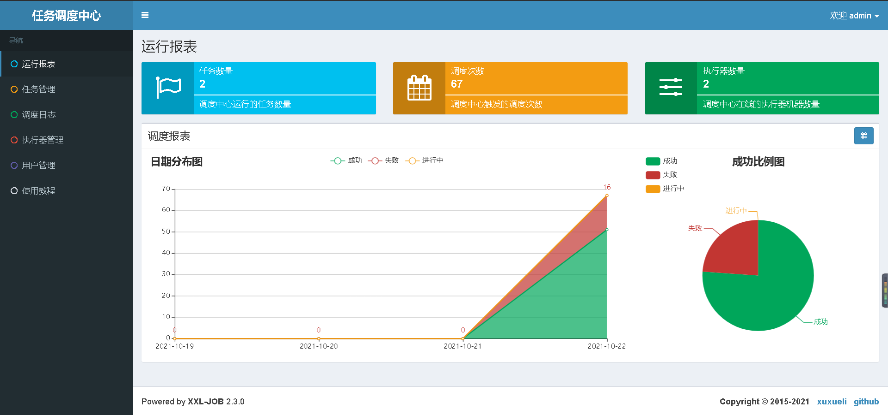
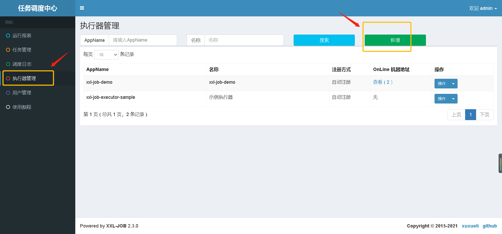
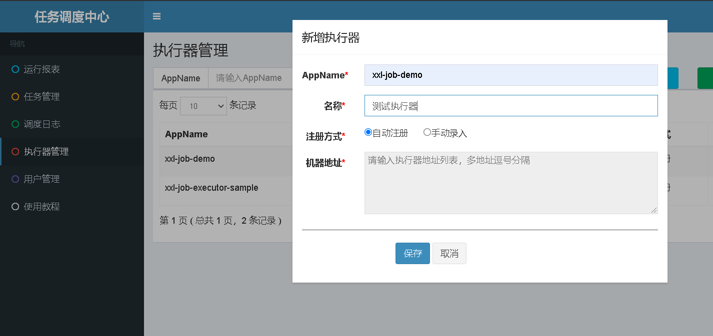
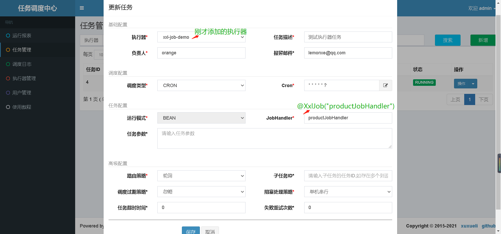
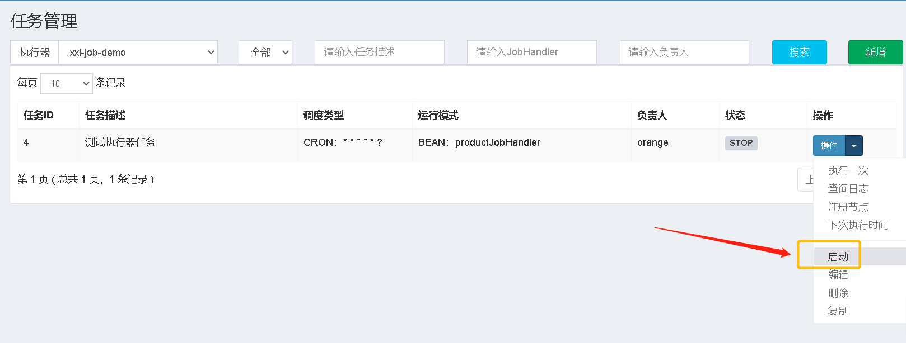

xxl-job分布式定时任务分为两个部分：调度中心和执行器；

调度中心通过Web页面对任务进行CRUD操作，统一管理任务调度平台上调度任务，负责触发调度执行。

执行器是要处理的任务

下面看一下怎么使用xxl-job分布式定时任务

# 初始化数据库

请下载项目源码并解压，获取 “调度数据库初始化SQL脚本” 并执行即可。
Github地址： https://github.com/xuxueli/xxl-job
码云地址：http://gitee.com/xuxueli0323/xxl-job

“调度数据库初始化SQL脚本” 位置为:
```
/xxl-job/doc/db/tables_xxl_job.sql
```
调度中心支持集群部署，集群情况下各节点务必连接同一个mysql实例;

如果mysql做主从,调度中心集群节点务必强制走主库;

# 部署调度中心
将下载的的xxl-job项目导入到IDEA中
```
xxl-job
  doc SQL脚本
  xxl-job-admin：调度中心
  xxl-job-core：公共依赖
  xxl-job-executor-samples：执行器Sample示例（选择合适的版本执行器，可直接使用，也可以参考其并将现有项目改造成执行器）
    ：xxl-job-executor-sample-springboot：Springboot版本，通过Springboot管理执行器，推荐这种方式； ：xxl-job-executor-sample-frameless：无框架版本； pom.xml ``` 配置调度中心，主要配置调度中心的数据源 ``` server.port=9990 server.servlet.context-path=/xxl-job-admin

### 调度中心JDBC链接，就是刚才创建的数据库 spring.datasource.url=jdbc:mysql://127.0.0.1:3306/xxl_job?useUnicode=true&characterEncoding=UTF-8&autoReconnect=true&serverTimezone=Asia/Shanghai spring.datasource.username=root spring.datasource.password=root_pwd spring.datasource.driver-class-name=com.mysql.jdbc.Driver

### 报警邮箱 spring.mail.host=smtp.qq.com spring.mail.port=25 spring.mail.username=xxx@qq.com spring.mail.password=xxx spring.mail.properties.mail.smtp.auth=true spring.mail.properties.mail.smtp.starttls.enable=true spring.mail.properties.mail.smtp.starttls.required=true spring.mail.properties.mail.smtp.socketFactory.class=javax.net.ssl.SSLSocketFactory

### 调度中心通讯TOKEN [选填]：非空时启用； xxl.job.accessToken=

### 调度中心国际化配置 [必填]： 默认为 "zh_CN"/中文简体, 可选范围为 "zh_CN"/中文简体, "zh_TC"/中文繁体 and "en"/英文； xxl.job.i18n=zh_CN

## 调度线程池最大线程配置【必填】 xxl.job.triggerpool.fast.max=200 xxl.job.triggerpool.slow.max=100

### 调度中心日志表数据保存天数 [必填]：过期日志自动清理；限制大于等于7时生效，否则, 如-1，关闭自动清理功能； xxl.job.logretentiondays=30
```

如果已经正确进行上述配置，可将 xxl-job-admin 项目编译打包部署。

调度中心访问地址：http://localhost:8080/xxl-job-admin (该地址执行器将会使用到，作为回调地址)

默认登录账号 “admin/123456”, 登录后运行界面如下图所示。
 


调度中心支持集群部署，提升调度系统容灾和可用性。

调度中心集群部署时，几点要求和建议：

DB配置保持一致；
集群机器时钟保持一致（单机集群忽视）；
建议：推荐通过nginx为调度中心集群做负载均衡，分配域名。调度中心访问、执行器回调配置、调用API服务等操作均通过该域名进行。

# 创建执行器项目

创建一个SpringBoot项目，加入xxl-job-core” 的maven依赖
```
<dependency>
    <groupId>com.xuxueli</groupId>
    <artifactId>xxl-job-core</artifactId>
    <version>2.3.0</version>
</dependency>
```

添加配置
```yaml
server:
  port: 8081

xxl:
  job:
    # 执行器通讯TOKEN [选填]：非空时启用；
    accessToken:
    # 调度中心部署跟地址 [选填]：如调度中心集群部署存在多个地址则用逗号分隔。
    #执行器将会使用该地址进行"执行器心跳注册"和"任务结果回调"；为空则关闭自动注册；
    admin:
      addresses: http://127.0.0.1:9990/xxl-job-admin
    executor:
      # 执行器IP [选填]：默认为空表示自动获取IP，
      # 多网卡时可手动设置指定IP，该IP不会绑定Host仅作为通讯实用；
      #  地址信息用于 "执行器注册" 和 "调度中心请求并触发任务"；
      ip:
      # 执行器端口号 [选填]：小于等于0则自动获取；默认端口为9999，单机部署多个执行器时，注意要配置不同执行器端口；
      port: 9999
      # 执行器注册 [选填]：优先使用该配置作为注册地址，为空时使用内嵌服务 ”IP:PORT“ 作为注册地址。从而更灵活的支持容器类型执行器动态IP和动态映射端口问题。
      address:
      # 执行器AppName [选填]：执行器心跳注册分组依据；为空则关闭自动注册
      appname: xxl-job-demo
      # 执行器运行日志文件存储磁盘路径 [选填] ：需要对该路径拥有读写权限；为空则使用默认路径；
      logpath: E:/log/xxl-job-demo
      # 执行器日志文件保存天数 [选填] ： 过期日志自动清理, 限制值大于等于3时生效; 否则, 如-1, 关闭自动清理功能；
      logretentiondays: 30
```

配置执行器组件
```java
@Configuration
public class XxlJobConfig {
    private Logger logger = LoggerFactory.getLogger(XxlJobConfig.class);

    @Value("${xxl.job.admin.addresses}")
    private String adminAddresses;

    @Value("${xxl.job.accessToken}")
    private String accessToken;

    @Value("${xxl.job.executor.appname}")
    private String appname;

    @Value("${xxl.job.executor.address}")
    private String address;

    @Value("${xxl.job.executor.ip}")
    private String ip;

    @Value("${xxl.job.executor.port}")
    private int port;

    @Value("${xxl.job.executor.logpath}")
    private String logPath;

    @Value("${xxl.job.executor.logretentiondays}")
    private int logRetentionDays;


    @Bean
    public XxlJobSpringExecutor xxlJobExecutor() {
        logger.info(">>>>>>>>>>> xxl-job config init.");
        XxlJobSpringExecutor xxlJobSpringExecutor = new XxlJobSpringExecutor();
        xxlJobSpringExecutor.setAdminAddresses(adminAddresses);
        xxlJobSpringExecutor.setAppname(appname);
        xxlJobSpringExecutor.setAddress(address);
        xxlJobSpringExecutor.setIp(ip);
        xxlJobSpringExecutor.setPort(port);
        xxlJobSpringExecutor.setAccessToken(accessToken);
        xxlJobSpringExecutor.setLogPath(logPath);
        xxlJobSpringExecutor.setLogRetentionDays(logRetentionDays);
        return xxlJobSpringExecutor;
    }

    /**
     * 针对多网卡、容器内部署等情况，可借助 "spring-cloud-commons" 提供的 "InetUtils" 组件灵活定制注册IP；
     *
     *      1、引入依赖：
     *          <dependency>
     *             <groupId>org.springframework.cloud</groupId>
     *             <artifactId>spring-cloud-commons</artifactId>
     *             <version>${version}</version>
     *         </dependency>
     *
     *      2、配置文件，或者容器启动变量
     *          spring.cloud.inetutils.preferred-networks: 'xxx.xxx.xxx.'
     *
     *      3、获取IP
     *          String ip_ = inetUtils.findFirstNonLoopbackHostInfo().getIpAddress();
     */
}
```

开发第一个任务
```java
@Slf4j
@Component
public class TestJobHandler  {

    @XxlJob("productJobHandler")
    public void productJobHandler() throws Exception {
        log.info("test xxl-job productJobHandler....");
    }
}
```

接下来去调度中心 添加执行器，配置执行器任务的触发时间，打开调度中心 http://localhost:9990/xxl-job-admin/

点击左侧导航栏的 执行器管理 新增
 


AppName就是刚才在执行器项目中配置的`执行器AppName`，注册方式选择 自动注册

 


添加任务
点击左侧导航栏的 任务管理 > 新增，执行器选择刚才添加的执行器，JobHandler就是刚才在执行器项目中` @XxlJob("productJobHandler")`注解中的值
CRON 选择执行的时间，这里是每米执行一次，还可以填写邮箱，任务执行出错时会发邮件提醒
 


执行任务，点击刚才添加的这条记录后面的操作按钮下拉列表，启动
 
        
