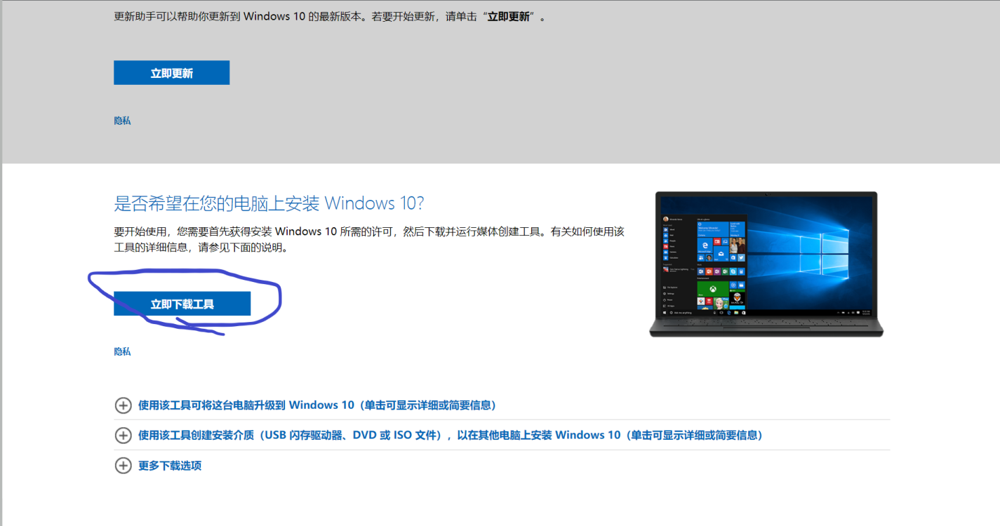
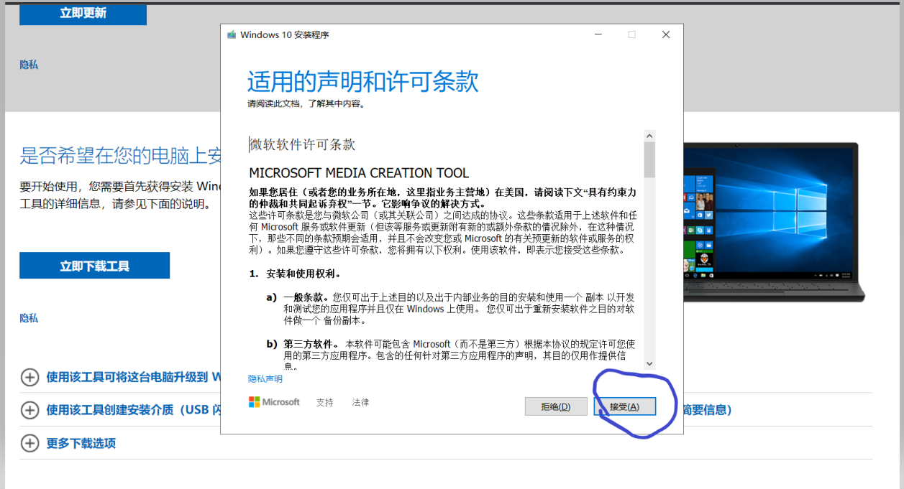
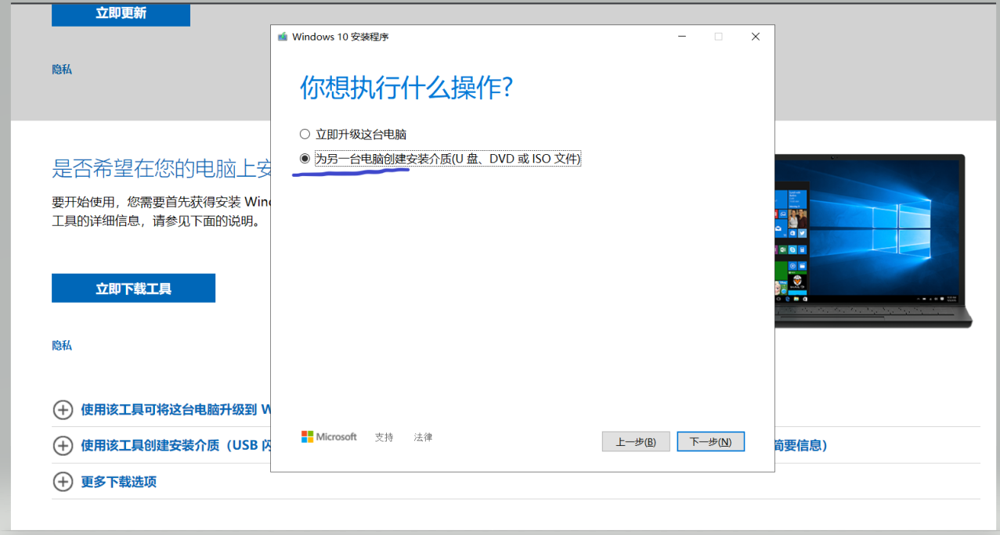
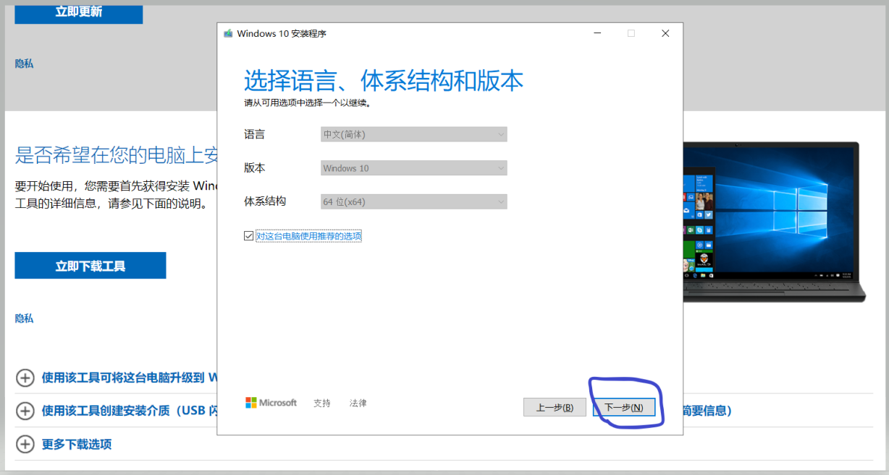
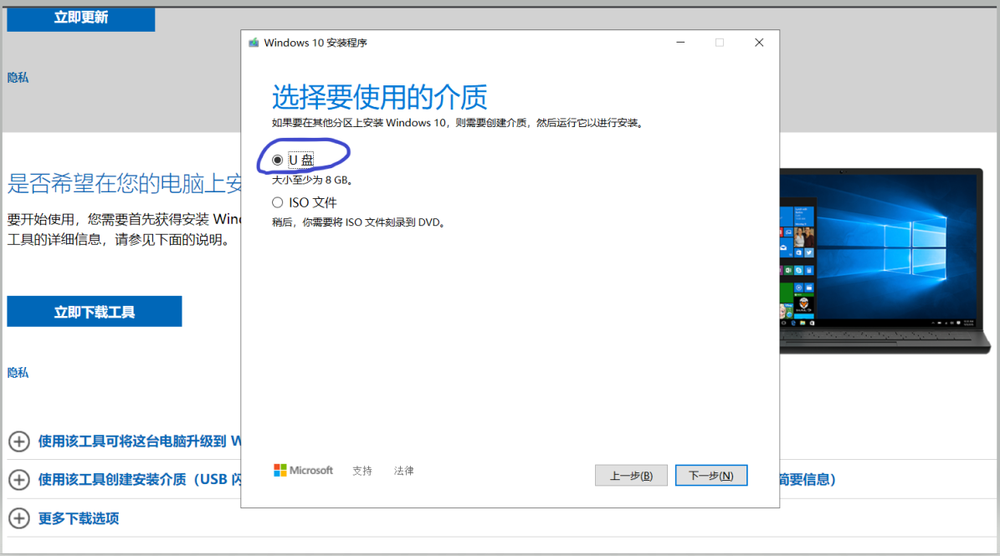
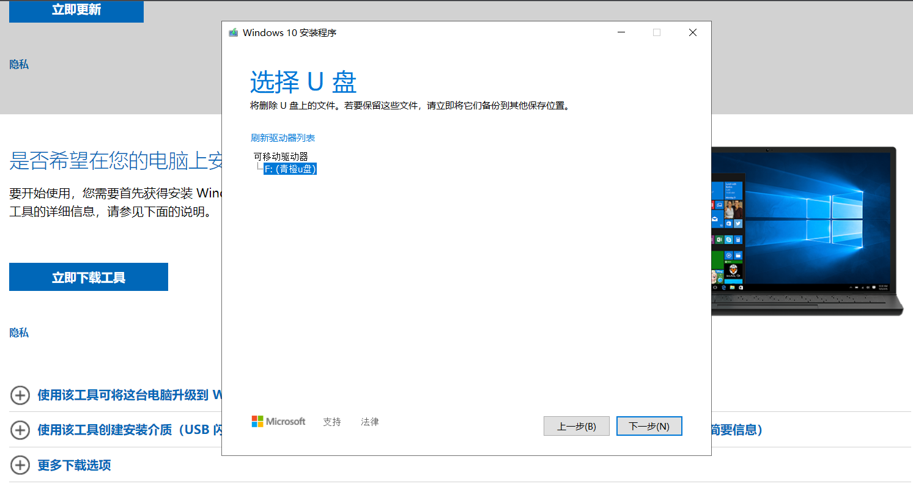
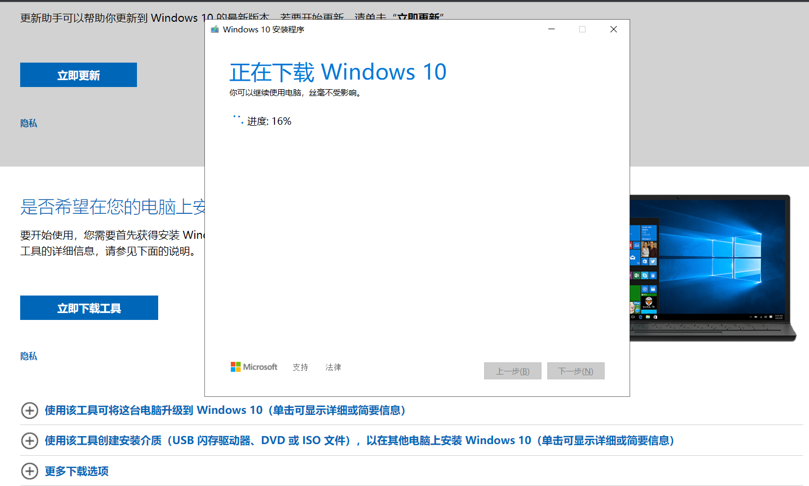

制作 Windows 10 U盘启动盘，不会捆绑第三方软件，从U盘启动就能看见Windows的安装界面。

1. 点击以下连接进入windows官方
[https://www.microsoft.com/zh-cn/software-download/windows10%20]()

2. 下载工具

3. 安装下载的工具

4. 插入U盘，选择 为另一台电脑创建安装介质(U盘、DVD或ISO文件)，下一步

5. 选择语言、版本，一般默认就可以，下一步

6. 选择 U盘，点击下一步

7. 选择刚才插入的U盘，点击下一步

8. 等待下载 Windows 10，网速慢的话可以泡杯茶慢慢等

接下来从U盘启动就可以重装系统了
        
